# WebSocket Scaling with AWS Application Load Balancer Tutorial


## 1. Introduction

This tutorial demonstrates how to scale a real-time WebSocket application using FastAPI, Redis pub/sub, and AWS Application Load Balancer (ALB). We'll build a todo application with chat functionality that can handle multiple users across multiple server instances while maintaining real-time communication and session persistence.


The application features:
- **WebSocket connections** for real-time chat and todo updates
- **Redis pub/sub** for cross-instance message broadcasting
- **Session affinity** to maintain user connections to specific servers
- **Horizontal scaling** across multiple EC2 instances

## 2. Objectives

1. **Docker & Containerization**
   - Build and run multi-container applications with Docker Compose
   - Configure container networking and environment variables
   - Manage persistent data with volumes

2. **Shared State with Redis**
   - Configure Redis as a central message broker
   - Implement pub/sub patterns for real-time communication
   - Store client connection metadata across multiple servers
   - Broadcast messages to all connected clients regardless of server

3. **Infrastructure as Code (IaC)**
   - Use Pulumi to provision AWS resources programmatically
   - Manage cloud infrastructure with Python
   - Export and reference infrastructure outputs

4. **WebSocket Scaling Patterns**
   - Implement Redis pub/sub for cross-instance message broadcasting
   - Handle session affinity and sticky sessions
   - Manage stateful connections in distributed systems

5. **AWS Infrastructure**
   - Deploy EC2 instances across multiple availability zones
   - Configure Application Load Balancer (ALB) for WebSocket traffic
   - Set up security groups and VPC networking

6. **Application Architecture**
   - Design scalable real-time applications
   - Implement persistent client identification
   - Handle graceful failover and reconnection
     
## 3. Architecture Overview


- **AWS deployment with ALB, EC2 instances, and Redis**
.svg)


- **Local Docker Compose setup with nginx load balancer**

```mermaid
graph TD
    %% User and Browser
    U[👤 User] --> B[🌐 Browser<br/>localhost:80]
    
    %% Nginx Load Balancer
    B --> N[🔄 Nginx Load Balancer<br/>Port 80<br/>Session Affinity]
    
    %% App Servers
    N --> A1[🐳 App Server 1<br/>Port 8001<br/>INSTANCE_ID: app-server-1]
    N --> A2[🐳 App Server 2<br/>Port 8002<br/>INSTANCE_ID: app-server-2]
    
    %% Redis Server
    A1 --> R[📊 Redis Server<br/>Port 6379<br/>Pub/Sub Messages]
    A2 --> R
    
    %% WebSocket Connections
    A1 -.->|WebSocket| B
    A2 -.->|WebSocket| B
    
    %% Docker Network
    subgraph Docker["🐳 Docker Compose Network"]
        N
        A1
        A2
        R
    end
    
    %% Styling
    classDef userStyle fill:#e1f5fe,stroke:#01579b,stroke-width:2px,color:#000
    classDef loadBalancer fill:#f3e5f5,stroke:#4a148c,stroke-width:2px,color:#000
    classDef appServer fill:#e8f5e8,stroke:#1b5e20,stroke-width:2px,color:#000
    classDef redis fill:#fff3e0,stroke:#e65100,stroke-width:2px,color:#000
    classDef docker fill:#e3f2fd,stroke:#0db7ed,stroke-width:3px,color:#000
    
    class U,B userStyle
    class N loadBalancer
    class A1,A2 appServer
    class R redis
    class Docker docker
    
    linkStyle 0 stroke:#1976d2,stroke-width:4px
    linkStyle 1 stroke:#1976d2,stroke-width:4px
    linkStyle 2 stroke:#1976d2,stroke-width:4px
    linkStyle 3 stroke:#1976d2,stroke-width:4px
    linkStyle 4 stroke:#1976d2,stroke-width:4px
    linkStyle 5 stroke:#1976d2,stroke-width:4px
    linkStyle 6 stroke:#1976d2,stroke-width:3px
    linkStyle 7 stroke:#1976d2,stroke-width:3px

```

- **✅ With Sticky Sessions: Todos persist per client**

```mermaid
flowchart TD
    C1[👤 Client 1] --> ALB[🔄 Application Load Balancer<br/>WITH Sticky Sessions]
    C2[👤 Client 2] --> ALB
    
    ALB -->|Always routes<br/>Client 1| A1[🚀 App Server 1<br/>]
    ALB -->|Always routes<br/>Client 2| A2[🚀 App Server 2<br/>]
    
    A1 --> R[📊 Redis<br/>✅ Chat Messages]
    A2 --> R
    
    subgraph AWS["☁️ AWS Cloud"]
        ALB
        A1
        A2
        R
    end
    
    classDef client fill:#e3f2fd,stroke:#1976d2,stroke-width:2px,color:#000
    classDef alb fill:#f3e5f5,stroke:#7b1fa2,stroke-width:2px,color:#000
    classDef server fill:#e8f5e8,stroke:#388e3c,stroke-width:2px,color:#000
    classDef redis fill:#fff3e0,stroke:#f57c00,stroke-width:2px,color:#000
    classDef aws fill:#fff9c4,stroke:#f9a825,stroke-width:3px,color:#000
    
    class C1,C2 client
    class ALB alb
    class A1,A2 server
    class R redis
    class AWS aws
    
    linkStyle 0 stroke:#1976d2,stroke-width:4px
    linkStyle 1 stroke:#1976d2,stroke-width:4px
    linkStyle 2 stroke:#1976d2,stroke-width:4px
    linkStyle 3 stroke:#1976d2,stroke-width:4px
    linkStyle 4 stroke:#1976d2,stroke-width:4px
    linkStyle 5 stroke:#1976d2,stroke-width:4px
```



- **❌ Without Sticky Sessions: **

```mermaid
flowchart TD
    SC[👤 Same Client] --> ALBRR[🔄 Application Load Balancer<br/>WITHOUT Sticky Sessions]
    
    ALBRR -->|1st Request| AS1[🚀 App Server 1<br/>]
    ALBRR -->|2nd Request| AS2[🚀 App Server 2<br/>]
    ALBRR -->|3rd Request| AS1
    
    AS1 --> RR[📊 Redis<br/>✅ Chat still works]
    AS2 --> RR
    
    subgraph AWSRR["☁️ AWS Cloud - Round Robin"]
        ALBRR
        AS1
        AS2
        RR
    end
    
    classDef client fill:#ffebee,stroke:#d32f2f,stroke-width:2px,color:#000
    classDef alb fill:#ffebee,stroke:#d32f2f,stroke-width:2px,color:#000
    classDef server1 fill:#e8f5e8,stroke:#388e3c,stroke-width:2px,color:#000
    classDef server2 fill:#ffebee,stroke:#d32f2f,stroke-width:2px,color:#000
    classDef redis fill:#fff3e0,stroke:#f57c00,stroke-width:2px,color:#000
    classDef aws fill:#ffebee,stroke:#d32f2f,stroke-width:3px,color:#000
    
    class SC client
    class ALBRR alb
    class AS1 server1
    class AS2 server2
    class RR redis
    class AWSRR aws
    
    linkStyle 0 stroke:#1976d2,stroke-width:4px
    linkStyle 1 stroke:#1976d2,stroke-width:4px
    linkStyle 2 stroke:#1976d2,stroke-width:4px
    linkStyle 3 stroke:#1976d2,stroke-width:4px
    linkStyle 4 stroke:#1976d2,stroke-width:4px
    linkStyle 5 stroke:#1976d2,stroke-width:4px
```



- **Data flow diagrams for WebSocket messages and Redis pub/sub**

```mermaid
sequenceDiagram
    %% Participants
    participant Client1 as 👤 Client 1<br/>(Browser)
    participant Client2 as 👤 Client 2<br/>(Browser)
    participant LB as 🔄 Load Balancer<br/>Port 80
    participant App1 as 🚀 App Server 1<br/>Port 8001
    participant App2 as 🚀 App Server 2<br/>Port 8002
    participant Redis as 📊 Redis<br/>Port 6379

    %% Client 1 Connection Flow
    Client1 ->> LB: 1️⃣ WebSocket Connect
    LB ->> App1: Route to App1
    
    %% Client 2 Connection Flow
    Client2 ->> LB: 1️⃣ WebSocket Connect
    LB ->> App2: Route to App2
    
    %% Client 1 Message Flow
    Client1 ->> LB: 2️⃣ Send Chat Message
    LB ->> App1: Forward Message
    
    %% Redis Pub/Sub
    App1 ->> Redis: 3️⃣ PUBLISH chat_channel<br/>{"message": "Hello"}
    Redis ->> App1: 4️⃣ Message Broadcast
    Redis ->> App2: 4️⃣ Message Broadcast
    
    %% Client Message Delivery (through LB)
    App1 ->> LB: 5️⃣ Forward to Client1
    LB ->> Client1: Deliver Message
    App2 ->> LB: 5️⃣ Forward to Client2
    LB ->> Client2: Deliver Message
    
    %% Style
    rect rgb(230, 230, 255)
        Note over Client1,Client2: Chat Message Broadcasting
    end

    Note over Redis: SUBSCRIBE/PUBLISH<br/>Channel: chat_channel
```



## 4. Local Development Setup

### 4.1 Prerequisites

- Docker and Docker Compose installed
- Git for version control
- Basic knowledge of FastAPI and WebSocket

### 4.2 Running the Project Locally

1. **Clone and navigate to the project directory:**
```bash
cd /ws-todo
```

2. **Start the multi-instance setup with Docker Compose:**
```bash
docker compose up -d
```

This will start:
- `app-server-1` on internal port 8001
- `app-server-2` on internal port 8002  
- `redis` server for pub/sub communication
- `nginx` load balancer with session affinity on port 80

3. **Access the application:**
```bash
# Open in browser
http://localhost
```

4. **Test the scaling:**
   - Open multiple browser tabs/windows
   - Send chat messages and create todos
   - Verify messages broadcast across all connected clients
   - Check that todos remain persistent per client ID

5. **Monitor logs:**
```bash
# View all services
docker compose logs -f

# View specific service
docker compose logs -f app-server-1
docker compose logs -f nginx
docker compose logs -f redis
```

6. **Stop the local setup:**
```bash
docker compose down
```

## 5. AWS Deployment with Pulumi

### 5.1 AWS Infrastructure Setup and Create SSH Key

First, configure your AWS credentials and create the necessary infrastructure:

```bash
# Configure AWS CLI
aws configure
```

Enter your AWS Access Key ID, Secret Access Key, and preferred region (ap-southeast-1).

```bash
# Create project directory within ws-todo
cd /home/jilan/poridhi/ws-todo
mkdir pulumi-infrastructure
cd pulumi-infrastructure
```

```bash
# Install Python virtual environment if needed
sudo apt update
sudo apt install python3.8-venv -y
```

```bash
# Initialize Pulumi project
pulumi new aws-python
```

```bash
# Create SSH key pair for EC2 access
aws ec2 create-key-pair --key-name scaling-key --query 'KeyMaterial' --output text > scaling-key.pem

# Set proper permissions
chmod 400 scaling-key.pem
```

### 5.2 Copy the Pulumi Infrastructure Code

Replace the contents of `__main__.py` in your Pulumi project with the `pulumi.py` infrastructure code:


Make sure to update the `key_name` parameter to match your SSH key name (`scaling-key`).

### 5.3 Deploy Infrastructure

```bash
# Deploy AWS infrastructure
pulumi up --yes
```

This will create:
- VPC with public subnets across 2 availability zones
- 2 EC2 instances for app servers
- 1 EC2 instance for Redis server
- Application Load Balancer with target groups
- Security groups with appropriate rules

### 5.4 Get Infrastructure Outputs

```bash
# Get deployment outputs
pulumi stack output
```

Note down the following values:
- `app_server_1_ip`: Public IP of first app server
- `app_server_2_ip`: Public IP of second app server  
- `redis_endpoint`: Private IP of Redis server
- `alb_dns_name`: Load balancer DNS name

### 5.5 Prepare Application Files

First, update the Redis host configuration in your docker-compose files:

```bash
# Navigate back to the application directory
cd /home/jilan/poridhi/ws-todo

# Update Redis host in docker-compose-app1.yml with actual Redis private IP from pulumi output
sed -i 's/REDIS_HOST=.*/REDIS_HOST=<REDIS_PRIVATE_IP>/' tmp/chat-app/docker-compose-app1.yml

# Update Redis host in docker-compose-app2.yml with actual Redis private IP  
sed -i 's/REDIS_HOST=.*/REDIS_HOST=<REDIS_PRIVATE_IP>/' tmp/chat-app/docker-compose-app2.yml
```

**Note:** Replace `<REDIS_PRIVATE_IP>` with the actual Redis endpoint from your `pulumi stack output`.

Now create the application archive:

```bash
# Create archive with updated configuration
tar -czf chat-app.tar.gz -C tmp chat-app/

# Copy application archive to Pulumi directory
cp chat-app.tar.gz pulumi-infrastructure/
cd pulumi-infrastructure
```
### 5.6 Deploy to First EC2 Instance

Replace the IP addresses below with your actual outputs from `pulumi stack output`:

```bash
# Copy application to first EC2 instance
scp -i scaling-key.pem chat-app.tar.gz ubuntu@<APP_SERVER_1_IP>:/home/ubuntu/

# Deploy to first EC2 instance
ssh -i scaling-key.pem ubuntu@<APP_SERVER_1_IP>

# Extract and deploy
tar -xzf chat-app.tar.gz
cd chat-app

# Start the application
docker compose -f docker-compose-app1.yml up -d

# Verify deployment
docker ps
docker logs <container_id>

exit
```

### 5.7 Deploy to Second EC2 Instance

```bash
# Copy application to second EC2 instance
scp -i scaling-key.pem chat-app.tar.gz ubuntu@<APP_SERVER_2_IP>:/home/ubuntu/

# Deploy to second EC2 instance
ssh -i scaling-key.pem ubuntu@<APP_SERVER_2_IP>

# Extract and deploy
tar -xzf chat-app.tar.gz
cd chat-app


# Start the application
docker compose -f docker-compose-app2.yml up -d

# Verify deployment
docker ps
docker logs <container_id>

exit
```

### 5.8 Verify Redis Server Health

```bash
# Connect to Redis server
ssh -i scaling-key.pem ubuntu@<REDIS_PRIVATE_IP>

# Check Redis container status
docker ps

# Verify Redis is accepting connections
docker exec $(docker ps -q) redis-cli ping

# Should return: PONG

exit
```

### 5.9 Test the Deployed Application

1. **Access the application via Load Balancer:**
```bash
# Open in browser
http://<ALB_DNS_NAME>
```

2. **Test scaling and session affinity:**
   - Open multiple browser windows
   - Create todos in different windows
   - Send chat messages
   - Verify that todos stay with each client ID
   - Confirm chat messages broadcast to all connected clients

3. **Test health checks:**
```bash
# Check ALB target health in AWS Console
# Navigate to EC2 → Load Balancers → Target Groups
# Verify both instances show as "healthy"
```

## 6. Verification and Testing

### 6 Application Features to Test


**Chat Functionality:**
   - Send messages from multiple clients
   - Verify real-time message broadcasting
   - Test with clients connected to different servers


3. **Scaling Behavior:**
   - Monitor which server handles each request

   - Verify session affinity works correctly
   - Test reconnection behavior


### 6.2 Monitoring and Troubleshooting

```bash
# Check application logs on each server
ssh -i scaling-key.pem ubuntu@<SERVER_IP>
docker logs -f <container_name>

# Monitor Redis pub/sub
ssh -i scaling-key.pem ubuntu@<REDIS_IP>
docker exec -it $(docker ps -q) redis-cli monitor
```
### 6.3 Performance Monitoring

1. **Access Prometheus metrics:**
```bash
# Via load balancer
curl http://<ALB_DNS_NAME>/metrics

# Direct server access
curl http://<APP_SERVER_IP>:8000/metrics
```

2. **Key metrics to track:**
   - `http_requests_total` - Request counts and status codes
   - `app_uptime_seconds` - Application uptime
   - `websocket_connections_active` - Active WebSocket connections
   - `tasks_created_total` / `tasks_completed_total` - Background task metrics

3. **Real-time monitoring:**
```bash
# WebSocket connections count
docker exec <container_id> netstat -an | grep :8000 | wc -l


## 7. Cleanup

When you're done with the tutorial, clean up the AWS resources:

```bash
# Destroy infrastructure
pulumi destroy --yes

# Delete SSH key pair
aws ec2 delete-key-pair --key-name scaling-key

# Remove local key file
rm scaling-key.pem
```


## 8. Troubleshooting Common Issues

1. **WebSocket connection fails:**
   - Check security group rules for port 8000
   - Verify ALB health checks are passing
   - Ensure WebSocket upgrade headers are preserved

2. **Chat messages not broadcasting:**
   - Check Redis connectivity between app servers
   - Verify Redis pub/sub configuration
   - Monitor Redis logs for connection issues

3. **Session affinity not working:**
   - Confirm ALB sticky sessions are enabled
   - Check client cookie configuration
   - Verify load balancer target group settings


4. **Redis connection problems:**
   - Check security group allows port 6379
   - Verify Redis is bound to all interfaces
   - Test Redis connectivity with redis-cli


This tutorial provides a comprehensive guide to scaling WebSocket applications using modern cloud infrastructure and containerization technologies.
